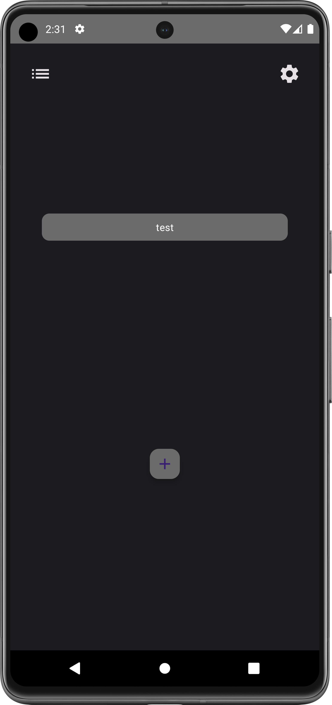
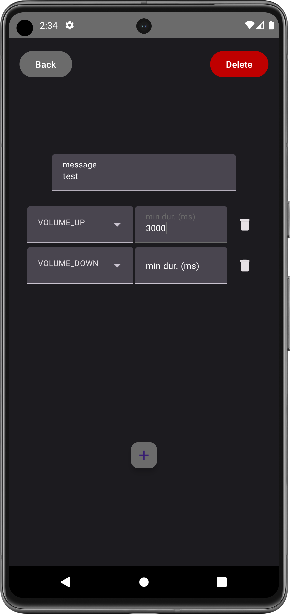
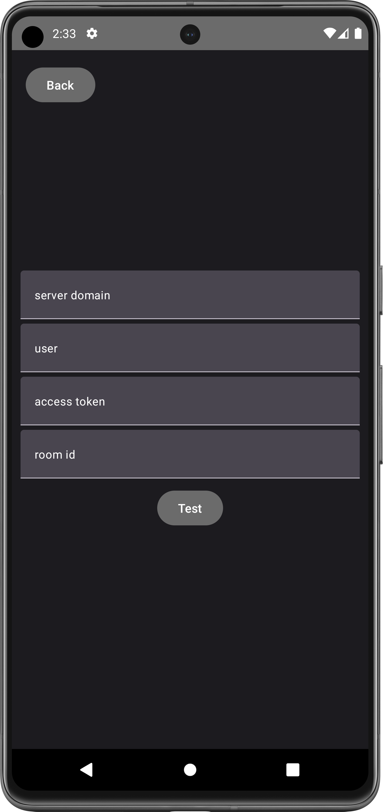

# Matrix shortcut
This app is a little tool with which you can send messages to a matrix server via gestures you configured before. The possible gesture buttons are only physical ones (volume up and down key) because the app's idea is that you can perform gestures also in your pants pocket. For example you're are right about to arive at home and want to open your door or turn the lights on.

  

## Features
- Configure matrix server
- Add/edit/remove shortcut
- Import/export app configuration
- Record gesture and find the matching one
- Send matrix messages

## Setup
### 1. Download the app(.apk)
Please take a look at the release tab here in the repository.
### 2. Install the app(.apk)
You have to allow installing apps from unknown sources via settings.
### 3. Activate the accessibility service / Make the app actual useful
The application provides an accessibility service you have to activate phone settings. 
Only with this step it's possible that the app records your gesture after you wake up your phone.
### 4. Configure the app and have fun!

# Development information
This project was created with android studio so for a struggle-less start you also should use it!